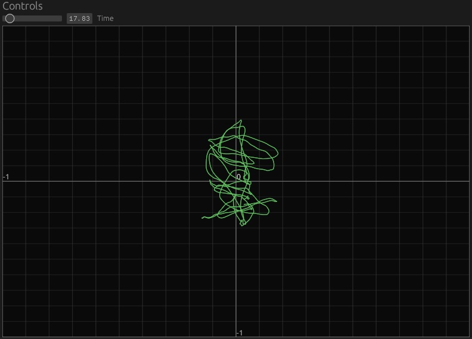

# Audio sound generation

Goofing with audio sound generation in Rust.

# Loader

The [src/bin/load.rs](src/bin/load.rs) program loads a synth configuration from
a config file and runs it.  Sample config files are in [configs](configs).
Run as `cargo run --bin load configs/simple.rau`. Run`cargo run --bin load` with
no arguments to see all modules and their arguments format.

The config file format is line-based with each line defining a module or a wire. 
Module lines start with an arbitrary name for the module instance, then the
module type, then any arguments used to instantiate the module. Wire lines start
with `wire` and the contain `module:outputname` and `module:inputname` arguments
which specify the source of a signal (must be an output of a module) and the 
destination of the signal (must be an input of a module).

Currently defined module types are:
* `add`
* `bias off width`
* `const val`
* `delay depth dry feedback`
* `envelope attack decay sustain release`
* `file fname`
* `filter filttype freq gain q`
* `flange functype freq manual width feedback`
* `inv`
* `keyboard polltime`
* `mult`
* `osc functype freq order`
* `osc2 functype freq [amp off]`
* `phaser functype freq width feedback`
* `speaker`

# Test programs

There are two programs that test the current features. 
The [src/bin/keyboard.rs](src/bin/keyboard.rs) example builds a small keyboard-based
synthesizer. Run with `cargo run --release --bin keyboard`.
The [src/bin/rau.rs](src/bin/rau.rs) example tests out various features as I
work on them. Most tests are commented out. Run with
`cargo run --bin rau`.

Running main with `cargo run` generates some ascii output and
some `.s16` files. The generated files are a single channel of
raw signed 16-bit samples in big endian and can be converted 
with sox or played directly:

    `sox -r 44100 -e signed -B -b 16 -c 1 sweep.s16 sweep.wav`
    `play -r 44100 -e signed -B -b 16 -c 1 sweep.s16`

# Helpers

The `filtviz` subdir contains a frequency response viewer for
the filter parameter generator.  Run with `cargo run -p filtviz`.

The `phaseviz` subdir contains a phase meter. It reads in a file
from the current directory named `test.wav` which should be a
stereo file with 16-bit samples at 44.1kHz. It visualizes the phases
as it plays the audio. Run with `cargo run -p phaseviz`.
Note: There's currently a bug where crashes can occur when quitting.

The `genviz` subdir contains a visualizer for the fourier series
generator. Run with `cargo run -p genviz`.

The `phaserviz` subdir contains a visualizer of the phaser's frequency response.

The `flangerviz` subdir contains a visualizer of the flanger's frequency response.

The `fftviz` subdir contains a spectrum visualizer for wav files. It reads
from a `test.wav` file in the current directory and animates the spectrum in
real time.

The `player` subdir contains code to test a resampler implementation,
playing a wav file at 44.1kHz to the audio device at 48kHz. It plays the
audio while visualizaing.
Note: There's currently a bug where crashes can occur when quitting.
